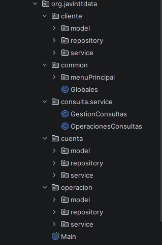

# [🏦NOVABANK DIGITAL SERVICES – Sistema de Gestión Bancaria]
>Proyecto en Java que simula un sistema bancario básico por consola.
>Permite gestionar clientes, cuentas y operaciones financieras usando estructuras en memoria.

---

## 📌 Funcionalidades

## 👤 Gestión de clientes
* Crear cliente
* Validar datos
* Listar clientes

## 🏦 Gestión de cuentas
* Crear cuenta asociada a un cliente
* Consultar cuentas
* Mostrar saldo

## 💳 Operaciones
* Depósitos
* Retiros
* Transferencias
* Historial de movimientos

## 🔎 Consultas
* Ver movimientos por cuenta
* Filtrar movimientos por rango de fechas

## 🗂 Estructura del proyecto
El proyecto está organizado por dominios y capas:

## ⚙️ Tecnologías usadas
* Java
