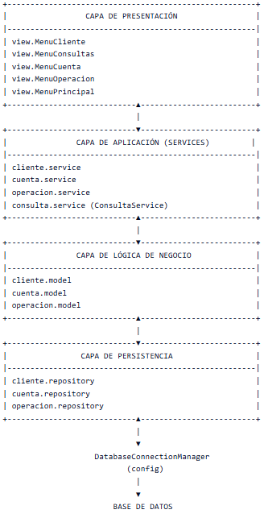

# NOVABANK DIGITAL SERVICES – Sistema de Gestión Bancaria

> Proyecto desarrollado en Java 17 que simula un sistema bancario por consola.  
> Permite gestionar clientes, cuentas y operaciones financieras utilizando PostgreSQL mediante JDBC, aplicando arquitectura por capas y buenas prácticas de diseño.

---

## Funcionalidades

### Gestión de clientes
* Crear cliente
* Buscar cliente
* Listar clientes

### Gestión de cuentas
* Crear cuenta asociada a un cliente
* Listar cuentas de un cliente
* Ver información de una cuenta

### Operaciones
* Depósitos
* Retiros
* Transferencias

### Consultas
* Consultar saldo
* Ver movimientos de una cuenta
* Filtrar movimientos de una cuenta por rango de fechas

---

## Estructura del proyecto
El proyecto está organizado por dominios y capas:

---

## Acceso a datos
* Implementación con JDBC
* Uso de PreparedStatement
* Uso de try-with-resources
* Conversión de ResultSet a objetos Java

## Instalacion de la base de datos
* En la carpeta resources se encuentra el archivo schema.sql.
* Ejecuta este archivo en tu consola de PostgreSQL para crear la base de datos y las tablas necesarias.

---

## Patrones
* Repository
  - Se utiliza una interfaz para definir el contrato que deben cumplir los repositorios, permitiendo una arquitectura más desacoplada y mantenible.
* Builder
  - Utilizado en ClienteService para mejorar la legibilidad y claridad en la creación de objetos complejos.
* Singleton 
  - Implementado en DatabaseConnectionManager para garantizar una única instancia de conexión y evitar la creación innecesaria de múltiples conexiones.
* Factory
  - Implementado en MovimientoFactory para centralizar y encapsular la creación de distintos tipos de movimientos.

---

## Tecnologías usadas
* Java 17
* Maven
* JUnit 5
* Mockito
* JDBC
* PostgreSQL
* Git

---

## Requisitos del sistema
* Java 17 o superior
* Maven 3.9 o superior
* PostgreSQL instalado y en ejecución

---

## Configuración de la base de datos
* La conexión se gestiona desde `DatabaseConnectionManager`
* Desde ahí podrás gestionar las credenciales
* private static final String URL = "jdbc:postgresql://localhost:5432/novabank"; 
* private static final String USER = "postgres"; <- Aqui pones tu usario 
* private static final String PASS = "******"; <- Aqui poner tu contraseña

---

## Cómo compilar
`mvn clean compile`

## Cómo ejecutar
`mvn exec:java`

## Cómo ejecutar los tests
`mvn test`

---

## Repositorio
https://github.com/JaviergpNTTDATA/CasoPractico1
